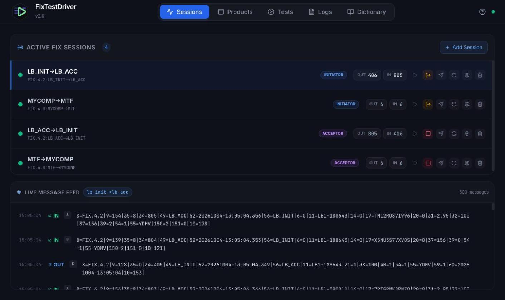
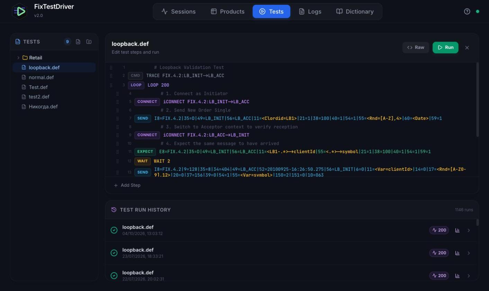
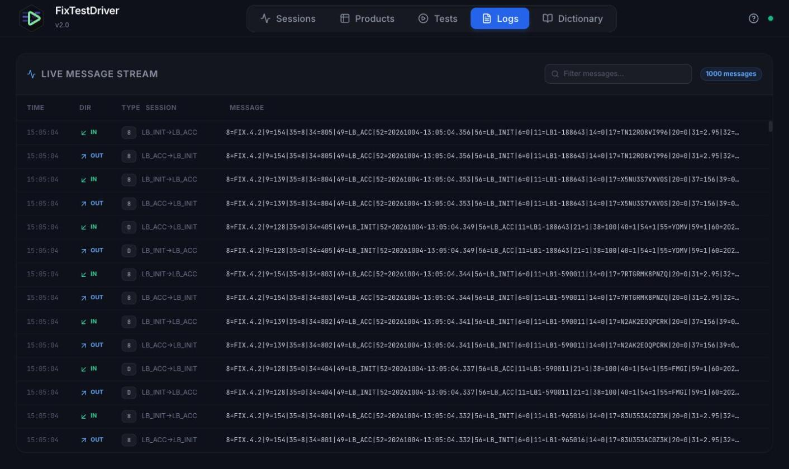
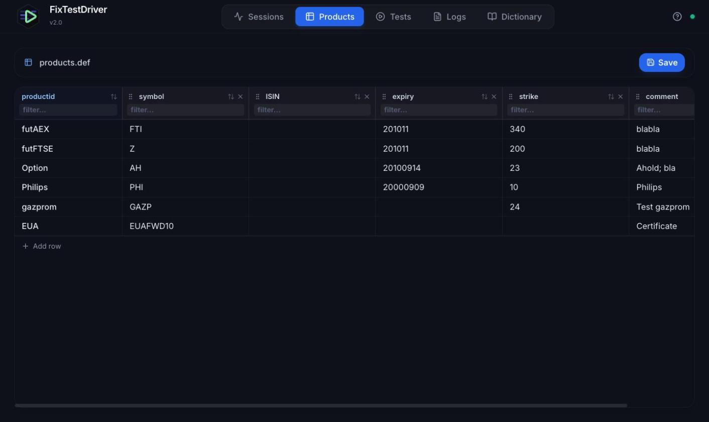
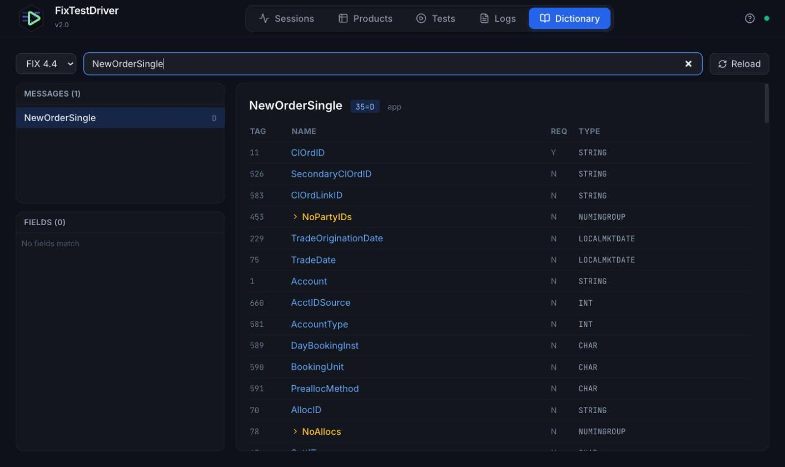

# FixTestDriver v2.0

[](https://github.com/pmvrolijk/FixTestDriver2/actions/workflows/ci.yml)
[](LICENSE)

## Project History
FixTestDriver was originally developed fifteen years ago as a Java 6 Swing application. It served as a specialized tool for testing FIX (Financial Information eXchange) protocol engines, allowing developers to define complex test scenarios using a custom `.def` scripting language. 

In 2026, the project underwent a complete architectural modernization to transition from a legacy desktop application to a cloud-ready, web-based platform.

## Key Features
- **Scriptable FIX Testing**: Run legacy `.def` scripts with support for dynamic macros (dates, randomized order IDs).
- **Dual FIX Role Support**: Support for both Initiator and Acceptor sessions within the same engine.
- **Modern Web UI**: A high-performance React dashboard with real-time session monitoring and message logs.
- **WebSocket Streaming**: Live FIX message events pushed from the engine to the browser.
- **Containerized Deployment**: Fully dockerized stack with persistent storage for logs, data, and configs.

## Screenshots

**Sessions**: initiator and acceptor sessions with live sequence numbers and a per-session message feed.


| Tests | Logs |
|---|---|
|  |  |
| Step editor for `.def` scripts with run history. | Live message stream across all sessions. |

| Products | Dictionary |
|---|---|
|  |  |
| Product definitions used by test-script macros. | FIX dictionary browser per protocol version. |

## Technology Stack
- **Backend**: Java 21, Spring Boot 3.3, QuickFIX/J 2.3.1, Spring Data JPA (H2).
- **Frontend**: React 18, Vite, TypeScript, Tailwind CSS, Lucide.
- **Infrastructure**: Docker, Docker Compose, Spring Boot Actuator (Health/Readiness).

## Quick Start (Docker)
Ensure Docker and Docker Compose are installed and running.

1. **Build and Start**:
   ```bash
   docker compose up --build -d
   ```
2. **Access the UI**: [http://localhost:3001](http://localhost:3001)
3. **Run a Test**: Go to the "Tests" tab, select `loopback.def`, and click Play.

## Developer Setup

### Prerequisites
- JDK 21+
- Node.js 18+
- Maven 3.9+

### Backend Development
1. Navigate to the `modern/` directory.
2. Run the application:
   ```bash
   mvn spring-boot:run
   ```
3. The API will be available at [http://localhost:8080](http://localhost:8080).

### Frontend Development
1. Navigate to the `modern-ui/` directory.
2. Install dependencies:
   ```bash
   npm install
   ```
3. Start the dev server:
   ```bash
   npm run dev
   ```
4. The UI will be available at [http://localhost:5173](http://localhost:5173) (proxied to 8080).

## Directory Structure
- `/trunk`: Legacy Java 6 Swing source code (Reference).
- `/modern`: Modern Spring Boot backend.
- `/modern-ui`: React frontend.
- `/config`: Externalized FIX engine and product configurations.
- `/data`: Persistent H2 database and test cases.
- `/logs`: FIX engine and application logs.

## Future Roadmap
- [ ] Web-based Test Case Editor.
- [ ] Single message ad hoc sending.
- [ ] Expanding scripting language features, loops, macros.
- [ ] Exchange simulator.
- [ ] Order view.
- [ ] Dictionary editor.
- [ ] Dynamic FIX Session Creator/Editor. Improved session management.
- [ ] Multi-tenant support and RBAC.

## Container Images
Every push to `Modernisation` or `master` publishes multi-arch (amd64/arm64) images to the GitHub Container Registry:
- `ghcr.io/pmvrolijk/fixtestdriver-backend`
- `ghcr.io/pmvrolijk/fixtestdriver-frontend`

Tags: `latest` (default branch), the branch name, `sha-<short>`, and semver tags for `v*` git tags.

## License
Copyright (C) 2026 P.M. Vrolijk

This program is free software: you can redistribute it and/or modify it under the terms of the
GNU Affero General Public License as published by the Free Software Foundation, either version 3
of the License, or (at your option) any later version.

This program is distributed in the hope that it will be useful, but WITHOUT ANY WARRANTY; without
even the implied warranty of MERCHANTABILITY or FITNESS FOR A PARTICULAR PURPOSE. See the
[GNU Affero General Public License](LICENSE) for more details.
